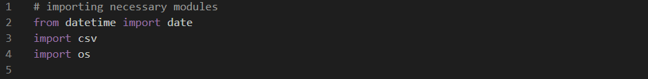
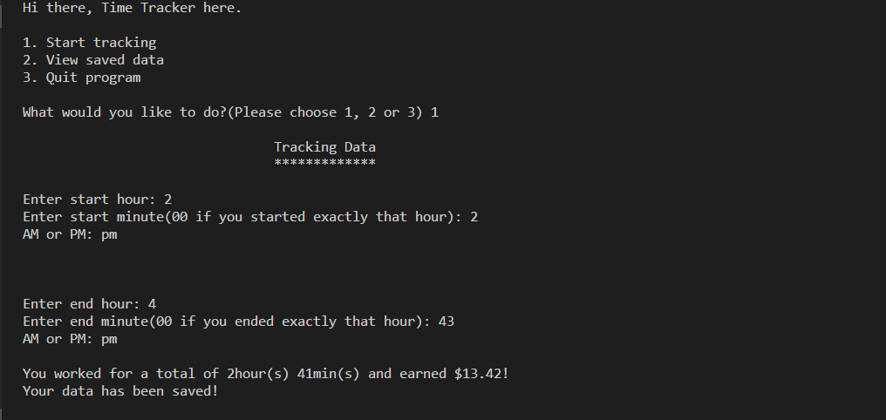
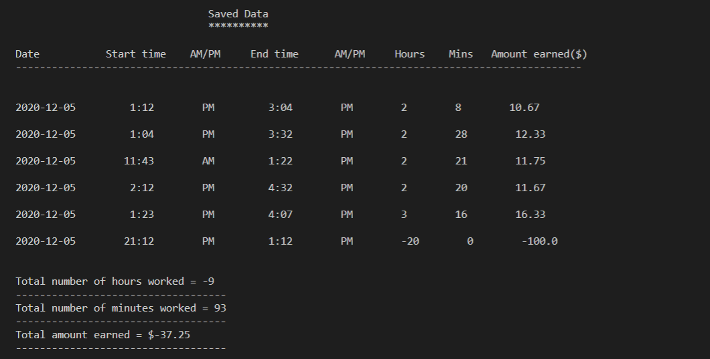

# Time Tracker ⌚💰

## What is it?
Time tracker is a simple  python program that keeps track of user work hours and amount earned within that period. Features of the program include

    •Recording start and end times a user worked during the day
    •Calculating hours worked and amount earned during that period
    •Automatically saving data to a csv file
    •Allowing user to view saved data and statistics related to it

The conversion used for the program is, an hour worked generates $5 i.e _1hour = $5 earned_.
The file generated by the program is stored under the name _timetracker.csv_ in your current directory or folder.

**NB:** The program does an awesome job at identifying every single situation that could lead to an error and takes the necessary precautions that is why the code appears plenty than necessary.

## Modules
The program uses python's standard built-in libraries for it's implementation. Modules imported are

    •date - To keep track of the current date data is being recorded
    •csv -  To save recorded data to a csv file for later use
    •os - To check file availability

## Design
The program uses 3 self defined functions for it's functioning.

    •diff_mins() - Used by start_tracking() for running part of it's code
    •start_tracking() - Contains code that starts the main tracking process and saves data to a csv file
    •view_data() - Contains code for retrieving saved data from the timetracker.csv file.

## Getting started
  •To start using the program run the _TimeTracker.py_ file

  •To start the tracking process select 1 from the menu and follow prompt. sample example is shown below
  

  •To view your saved data select 2. Sample data is shown below
  

  •To do nothing and close the program the last option is your only option. LOL.

Don't be scared of making a mistake when entering data beacause you can try again as many times as it takes to get your inputs right😉

## ENJOY!❤❤
